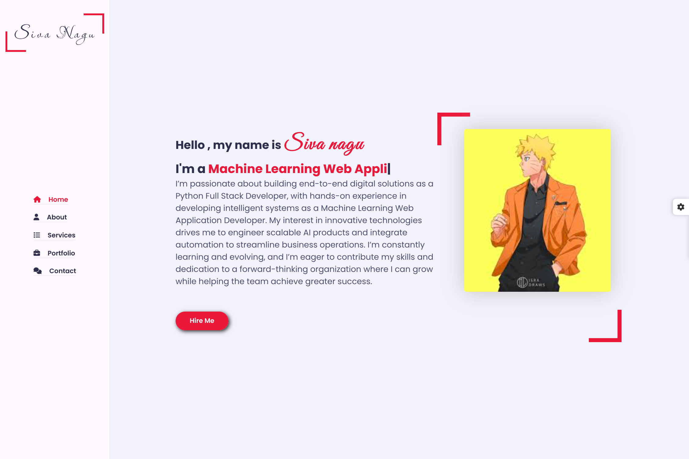

# Portfolio Thumbnail 

## Overview

This portfolio is a modern frontend project built with HTML, CSS, JavaScript, and Bootstrap. It showcases a clean one-page layout with interactive navigation, theme customization, and a personal profile designed for hiring managers and clients.

## Live Demo

https://portfolio-p1zu.onrender.com/

## Key Features

- Responsive one-page portfolio layout with a fixed sidebar navigation
- Smooth scrolling and active section highlighting
- About section with biography, personal details, skills, and resume download
- Services and portfolio/project showcase sections for frontend experience
- Contact call-to-action to make it easy for visitors to hire or connect
- Theme switcher with multiple color skins for a personalized look
- Dark/light mode toggle for improved accessibility and user preference
- Bootstrap and Font Awesome integration for responsive design and icons

## Technology Stack

- HTML5
- CSS3
- JavaScript
- Bootstrap 5
- Font Awesome

## Project Highlights

- Interactive navigation built with vanilla JavaScript
- Reusable component styling and responsive layout
- Custom theme switching and dark mode support
- Hosted live on Render for easy sharing and review

